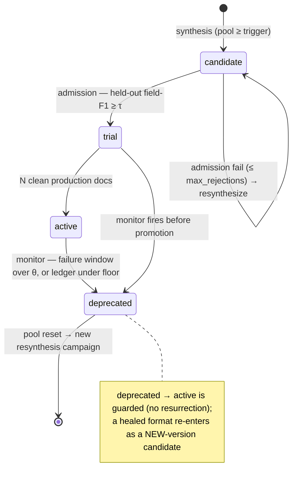
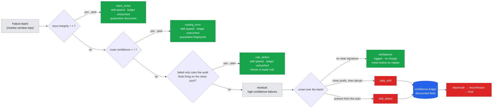

# PROVE

**PROVE** (Procedural Reuse via Outcome-Verified Executables) governs **procedural memory as
executable skills** — written, recalled, and forgotten by deterministic downstream outcomes, with
attribution deciding *which* memory to forget.

As the agent processes documents it **accumulates its experience into executable skills (Python
parser code)** — its procedural memory. It **recalls** a skill by document format instead of
re-invoking the LLM, and each skill's admission, retention, and **forgetting** are decided entirely
by **downstream objective outcomes** (regression tests, rule validation, production pass/fail),
never by LLM subjective scoring. An **attribution module** makes forgetting *smart*: it charges
every production failure to the right account (skill defect / routing error / validation-rule
defect / data drift / degraded input), so a healthy memory is not forgotten for a failure it did
not cause (in the fault-injection evals below, A3 forgets **zero** healthy memories where A2
forgets 4).


> **The loop:** the agent compiles its experience into cheap verified code and writes itself out of
> the hot path; every **write, recall, and forget** in this memory is decided by a deterministic
> downstream check. An **animated walk-through** (cold start → a skill is learned → recall collapses
> cost → drift → smart forgetting → relearn) lives in
> [`docs/prove_explainer.html`](docs/prove_explainer.html).

## Layout

```
prove-agent/
├── configs/default.yaml        # thresholds, model names, paths, ablation flags
├── src/prove/                  # pipeline components
│   └── datasets/               # real-dataset adapters (CORD-v2 → the text_layout ABI)
├── evals/                      # ablation runner, plots, scenarios
│   └── live_results/           # real-Qwen run artifacts + the parser code synthesised
└── tests/                      # pytest unit + integration tests
```

## Hard design rules

1. No LLM component ever issues a quality verdict. Verdicts come only from deterministic
   downstream checks. Attribution reads objective signals + traces and assigns *blame
   accounts*; it never judges output quality.
2. Skills are pure executors — no format-detection logic. Routing is a separate component.
3. All synthesized code executes only inside the sandbox.
4. Every execution writes a structured trace from day one.

## Memory lifecycle (a skill's life)

A procedural memory is **written** (synthesized), **validated** (admitted), **recalled**
(served), and **forgotten** (deprecated). Every transition is caused by a **deterministic
event** — never an LLM opinion:



## Status

**Phase 5 complete — attribution *is* smart forgetting.** *Which* memory to forget is a mixed
signal: a routing misdelivery, a corrupted validator rule, and a genuinely broken skill all look
the same at the skill's door. Attribution decomposes a failure batch to its root cause **before**
the confidence ledger forgets anything, so a healthy memory is never forgotten for a failure it did
not cause — the *"smart data-forgetting"* the MemoryAgent brief calls for.



*Green bins spare the skill (a routing / rule / no-signature failure is not the skill's account);
only the red bins reach the ledger and deprecate. The accountant assigns blame for already-established
failures — it never scores output quality.*

- **Attribution** (`attribution.py`): a deterministic classifier over the failure batch. It
  *peels* per-doc — the degraded-input failures, the low-confidence (misrouted) failures and the
  frozen-rule failures are exonerated to their own accounts, and only the residual high-confidence
  failures can be charged to the skill. No LLM issues a verdict (Hard Design Rule 1); the LLM
  escalation for genuinely ambiguous batches is the honest fallback's optional last step.
- **`input_noise`, the fifth account**: a document whose *own extracted text* is degraded is
  nobody's fault. `layout.input_integrity` measures it deterministically at ingestion (fraction of
  character-class-clean tokens; born-digital extraction scores 1.0) and it is peeled **first** —
  garbled header tokens also depress route confidence, so a doc eligible for two peels must be
  charged to the root cause, not the symptom. Unique among the accounts in having no party to
  charge and nothing to repair: the remedy is to quarantine the document. Without it a degraded doc
  routes exactly, fails at high confidence, survives every other peel, and is charged to a healthy
  skill as `skill_defect`.
- **Deferred charging** (`pipeline.py`): in A3 a skill *pass* charges the ledger immediately
  (unambiguous), but a *failure* is only logged until the batch is attributed — β is charged **iff**
  attribution finds the skill at fault. A2 charges every failure raw (no attribution). That one
  branch is the whole A2-vs-A3 difference.
- **Fault injectors** (`datagen/faults.py`) with logged ground truth: `NoisyRouter` (force a
  fraction of correct traffic to another format's skill at *genuine* low Jaccard — never a
  fabricated number), template drift (Phase 3), a `corrupt_validator` that spuriously rejects a
  valid currency, and `LayoutGarbler` (junk glyphs over a band of the page body, modelling an
  unreadable scan region — it leaves the header fingerprint intact, so the doc still routes
  exactly and the failure is invisible to every peel but the integrity one). **Audit** (`audit.py`) re-validates the immutable verified pool; a rule that now
  fires on samples that passed at admission is the corrupted rule (the pool didn't change — the rule
  did) — that is attribution's rule-defect cross-check.

**Headline — A2 vs A3 under 20 % routing noise** (`scenarios/routing_noise_demo.py`, key-free):

| arm                 | healthy memories forgotten (= skills deprecated) | recall-served docs | tokens/doc |
| ------------------- | ------------------------------------------------ | ------------------ | ---------- |
| A2 (no attribution) | **4**                                      | 83 %               | 42.1       |
| A3 (attribution)    | **0**                                      | 100 %              | 0.0        |

Under the *same* injected noise, A2 wrongly **forgets** healthy memories — their traffic thrashes
back to the LLM and must re-learn the skill, so cost rebounds — while A3 attributes the failures to
the router and keeps every memory alive. This is the "smart data-forgetting" claim, quantified.


**Attribution fault-injection coverage** (`evals/attribution_matrix.py`): injected-vs-attributed,
**full diagonal** across routing_error / data_drift / rule_defect (n=14). This is a *coverage*
result, not a statistical accuracy claim — the classifier is deterministic and the runs are
single-fault, so a full diagonal reads as "every planted root cause leaves a separable signature the
peel recovers, with zero cross-cause confusion." Mixed-cause resolution (the peel exonerating
misroutes while charging a concurrent drift) is shown at unit level. `skill_defect` is the residual
hypothesis (what's left after routing/rule/drift are peeled) and has no clean production injector.


**Evidence card** — every `POST /extract` response (`service.py`) carries routing evidence,
executor identity + confidence, the per-rule validation verdict, and cost, all lifted from the
Trace. Auditability is a first-class output, not a bolt-on log.

**Designed limitations.** *routing_error*'s remedy is to spare the skill's ledger and
log a quarantine event — the misrouted document still fails validation loudly (never silent garbage);
enacting the re-route is a router-subsystem change, and repeated quarantine verdicts are the signal a
real router-repair hook would consume. Under *heavy* noise (contrast lost — no clean high-confidence
baseline in the window) the peel cannot prove the skill works, so it conservatively charges the skill
and A3 degrades toward A2 behaviour by design. `_frozen_rules` is global across formats (matches the
validator-wide fault model) and monotone (rule *repair* is out of scope).

<details><summary>Phase 3 — continuous monitoring + self-healing</summary>

A live monitor watches every skill's validation outcomes and self-heals under drift:

```
skill serving a format → template drift → skill's validation failures accumulate
  → monitor deprecates (sliding-window failure rate, or confidence floor) → traffic falls back to the LLM
    → pool re-accumulates fresh post-drift samples → resynthesis → new skill admitted → serving again
```

- **Monitor** (`monitor.py`): a per-`skill_id` sliding window (a resynthesized skill starts
  clean) plus the discounted-Beta confidence floor. Fast path (window failure rate over threshold,
  with an absolute failure floor so routing noise can't kill a young skill) or slow path (ledger
  floor) → deprecate. Covers trial and active skills.
- **Self-healing** (`pipeline.py`): deprecation tombstones the stale pool (rows kept for
  attribution/audit, excluded from synthesis), drops the frozen admission holdout, and opens a
  fresh synthesis *campaign* (rejection counter reset, campaign id logged). Resynthesis re-fires
  only once the pool re-reaches the trigger with fresh post-drift samples.
- **Drift demo** (`scenarios/drift_demo.py`): injects a mid-stream date-format drift and produces
  the self-healing timeline with zero manual steps:

  ```
  v1 admitted → drift at doc 30 → deprecated at doc 35 (failure_batch:window 5/20)
    → LLM fallback → v2 admitted at doc 45 → healed   (key-free; --live carries real figures)
  ```

  

</details>

<details><summary>Phase 2 — skill synthesis + admission gate (the core loop)</summary>

A format's verified samples compile into an executable skill and the pipeline learns to serve
that format with cheap deterministic code instead of the LLM:

```
pool reaches synthesis_trigger → synthesis agent writes extract(text_layout) (self-repair in sandbox)
  → admission holds out 30% (never shown to synthesis), runs the candidate in the sandbox, scores field F1
      ├─ pass → trial (fingerprint registered in the router) → 10 clean docs → active
      └─ fail → resynthesize (max_rejections → flag for meta-review)
route hit on an active/trial skill → sandbox executes the code → validator checks → trace
```

- **Sandbox** (`sandbox.py`): every synthesized skill runs in an isolated `python -I` subprocess
  — CPU/memory rlimits, import whitelist (`re, json, datetime, decimal, math`), no I/O or network
  path, wall-timeout. Security-tested (import/open blocked, timeouts + memory caps enforced).
- **Confidence ledger** (`registry.py`): discounted-Beta counters per skill; admission seeds
  pseudo-counts from the held-out result (a skill is never born at 1.0); only attributed outcomes
  update it.
- **Ablations A0–A3** (`evals/ablation.py`): A0 baseline · A1 synthesis with **no** gate · A2 gate
  on · A3 = A2 + attribution (Phase 4). The A1-vs-A2 contrast is the headline result:

  | config                   | tokens/doc      | skill docs | silent failures                                 | skills                                   |
  | ------------------------ | --------------- | ---------- | ----------------------------------------------- | ---------------------------------------- |
  | A0 (no skills)           | 243.4           | 0          | 0                                               | —                                       |
  | A3 (gate + attribution)  | **173.3** | 102        | 0                                               | 7 active · 3 trial                      |
  | A1 (no gate, overfit)    | 145.1           | 142        | **63** — validation passes, fields wrong | 14 active                                |
  | A2 (same overfit stream) | 176.1           | 98         | **0**                                     | overfit rejected → good skills admitted |

  Cost-per-doc drops as skills come online; **without the held-out gate an overfit skill is
  admitted and emits silent, confident, deterministic wrong fields — the gate catches the exact
  same candidate.** A1 looks *cheaper* precisely because it serves more traffic from skills that
  should never have been admitted. 14 formats / 350 docs; reproduce every figure in this table with
  `python -m evals.ablation_curves` (it re-runs all four arms and writes `evals/out/`). Numbers are
  simulated/key-free; `--live` runs carry the real figures.

</details>

### Live runs — real Qwen

Everything above is key-free simulated. The live arms below run real `qwen-turbo` / `qwen-plus`
(extraction) and `qwen-coder-plus` (synthesis) over 420 documents each; artifacts, including the
**verbatim parser code the synthesiser wrote**, are in [`evals/live_results/`](evals/live_results/).
One arm measures a mechanism that these numbers led to removing; it is reported alongside the
others so the removal can be checked against the data behind it.

|                              | weak        | weak + cross-verify † | **strong**    | weak + rule 6 |
| ---------------------------- | ----------- | ---------------------- | ------------------- | ------------- |
| extraction model             | qwen-turbo  | qwen-turbo             | **qwen-plus** | qwen-turbo    |
| mean field F1                | 0.919       | 0.921                  | **1.000**     | 0.921         |
| validation pass rate         | 0.507       | 0.505                  | **1.000**     | 0.498         |
| skill-served docs            | 115         | 76                     | **198**       | 97            |
| **pool contamination** | **7** | —                     | —                  | **0**   |
| active skills                | 6           | 4                      | **10**        | 5             |
| total tokens                 | 260,669     | 292,289                | 312,788             | 234,674       |

† This arm measures the cross-model verifier, which was removed on the strength of these
numbers — the verifier and its `--verify-model` flag are no longer in the tree, so this column
alone does not reproduce. Artifacts remain in [`evals/live_results/`](evals/live_results/); the
other columns reproduce with
`python -m evals.ablation --config A3 --live --samples-per-format 30 --tag <arm>`.

**The extraction model, not the pipeline, drove the failures.** Same prompt, same rules, same
synthesiser: pass rate 0.51 → **1.00** purely by moving extraction to `qwen-plus`, for 20% more
tokens. `qwen-turbo`'s dominant error is layout-conditioned — a `Tax 8.25% 365.11` line makes it
return the *rate* where the schema declares a money *amount*.

**Cross-field checks held.** Under the weak extractor
`money_unparseable` fired 180 times and `date_unparseable` 27, keeping every one of those samples
out of the pool, so no skill was ever synthesised from them. Skill-served documents recorded
**zero** validation failures in every arm.

**Where it has none, errors reach the pool — and the fix is a rule, not a second model.** Measuring
which fields actually contaminated the verified pool gave exactly one: `vendor_name`, 7 of 98
entries, all the same failure — a two-column header renders invoice number and vendor on one line
and the extractor returned the whole line (`"NAK-2024-22337 Nakatomi Trading Co"`). Well-formed,
non-empty, wrong, and invisible to every form-level rule.

Gating pool entry on an independent second extractor detected ~20-29% of these, at +12% tokens,
and slowed skill formation — rejecting samples shrinks pools, so skill-served documents fell
115 → 76. Detection is capped because the second model shares the layout-induced confusion:
**correlated errors defeat cross-model agreement**, and layout ambiguity produces correlated
errors by construction. A three-line cross-field rule (fields must not swallow one another)
caught **2/2** live, **7/7** on replay of the prior run's outputs, and **0/420** false positives
on perfect extractions, at zero API cost — so the cross-model verifier was removed in favour of
the rule.

**Attribution issued zero verdicts in every arm.** It classifies *failure batches* raised by the
monitor, and the monitor watches validation outcomes; skill-served documents had zero validation
failures, so no batch formed. Silent failures pass validation by definition, so the monitor cannot
see them — they are caught at admission instead. The bottleneck for attribution is failures, not
document volume.

**Cost.** Tokens are the unit: Qwen Cloud bills by credit subscription with no published per-token
rate table, so `costs:` is empty and every `cost_usd: 0.0` in the artifacts is a null artifact, not
a measurement. Synthesis is the larger consumer and was previously invisible — 135,367 input tokens
on synthesis against 83,203 on extraction. Skill-served documents consume **zero** marginal
inference tokens; that is what the synthesis cost amortises against.

<details>
<summary>The first live run (210 docs) and the silent-failure mechanism it exposed</summary>

### First live run (210 docs)

Everything above is key-free simulated. One **live** run against real `qwen-turbo` (extraction) +
`qwen-coder-plus` (synthesis) — 210 docs, 14 formats, artifacts in
[`evals/live_results/`](evals/live_results/) — produced a result the simulated arms cannot
produce, and it bounds the claim above.

**Simulated arms (injected defects):** A1 = 63 silent failures over 142 skill-served docs;
A2/A3 = 0. These arms inject a memorization-overfit candidate and measure whether the gate
rejects it; they do not sample the defect distribution of a real synthesiser.

**Live A3:** **11 silent failures over 31 skill-served docs.** A *different* defect class, and the
gate cannot catch it by construction: admission scores a candidate against its format's verified
pool, and **the pool is LLM-produced** ([`admission.py`](src/prove/admission.py) compares against
pool fields, never ground truth). Where the extractor is systematically wrong on a field, the pool
encodes that error, the skill faithfully reproduces it, and admission sees agreement.

The boundary follows the rule set:

> The validator's only genuine **cross-field** check is `subtotal + tax == total`. Every money
> field held. `invoice_number` (no rule at all) and `line_item_count` (a *type*-only rule) are the
> only two fields that failed silently — and they account for **all eleven**.

Where the validator *had* a cross-check it worked: systematic tax-rate-vs-amount confusion on six
formats and date errors on a seventh were caught by `money_unparseable` / `date_unparseable`,
keeping corrupt samples out of the pool so those seven bad skills were **never synthesized**. The
gate rejected **4** synthesized candidates on real code and admitted 7.

**Severity.** Nine of the eleven are `invoice_number` on the two `banner.html` formats — the only
template that renders `#{{ invoice_number }}` while ground truth stores the value without the `#`.
The extractor copied the page verbatim, as its prompt instructs, so these are a normalization
mismatch introduced by the benchmark's own convention rather than a misread identifier. The
mechanism is the same either way: a systematic divergence between pool and ground truth propagates
into an admitted skill and a self-supervised oracle cannot see it. The other two are a
generalization defect — `line_item_count` on F1_acme, wrong on exactly the documents with 5 line
items, which a 3-document holdout had no power to detect.

> A self-supervised admission oracle bounds skill quality at
> the extractor's systematic-error floor. Deterministic outcome verification is only as strong as
> the cross-checks in the rule set — it cannot manufacture signal about fields no rule constrains.

Validation pass rate 0.5048 is layout-conditioned rather than random: seven of fourteen formats
had *100%* LLM validation failure, driven by a `Tax 8.25% 365.11` line that leads qwen-turbo to
return the rate as the amount. No skill reached `active` at this run scale — promotion needs
`synthesis_trigger` (10) + `trial_docs` (10) ≈ 20+ documents per format, and this run had 15.

**Cost.** 48,424 in / 16,920 out = **65,344 tokens** over 210 docs. The 31 skill-served docs
consumed **zero** marginal inference tokens — a compiled skill's per-document cost is CPU only.
The `cost_usd: 0.0` fields in the live artifacts are a **null artifact, not a measurement**: cost
accounting is implemented and provider-agnostic, but Qwen Cloud bills by credit subscription with
no published per-token rate table, so `costs:` is empty and spend is reported in tokens.

**Auditability limit.** The live run is not fully post-hoc auditable: the registry ran in-memory so
the synthesized skill code is gone, and traces store per-field booleans rather than extracted
values. The diagnosis above rests on per-format pool/skill correlation plus one confirming API
call, not on replaying the artifacts.

</details>

### Real data — CORD-v2 receipts (`evals/real_data.py`)

The synthetic ablations prove the *mechanism*; a real dataset tests **external validity**.
[`datasets/cord.py`](src/prove/datasets/cord.py) converts CORD-v2's own OCR word boxes and field
labels into the `text_layout` skill ABI, so **every downstream component runs on real receipts
unmodified** — no OCR engine, no special-casing. (CORD over SROIE because CORD labels
subtotal/tax/total, so the validator's only *cross-field* rule survives; SROIE's
company/date/address/total would reduce the verifier to presence checks.)

**What 100 real test receipts showed — this section claims safety, not recurrence:**

| observation          | value                              | reading                                                                                                                                                                                                                                         |
| -------------------- | ---------------------------------- | ----------------------------------------------------------------------------------------------------------------------------------------------------------------------------------------------------------------------------------------------- |
| skill hit rate       | **0 / 100**, all `miss`    | The fingerprint is a born-digital construct; real scans carry OCR jitter and crop/skew, so nothing exact-matches. The router**fails closed** and traffic falls back to the LLM at bounded cost — the safe outcome, and the expected one. |
| validation pass rate | 0.22                               | **A verifier-transfer finding, not a system metric — never quote it bare.** Decomposition below.                                                                                                                                         |
| input integrity      | median 1.000, p05 0.957, min 0.889 | 3/100 real docs fall under the 0.95 threshold, which was calibrated on synthetic damage only. None were skill-served, so no peel fired; the real-text false-positive rate is**unmeasured**.                                               |

The 0.22 decomposes, with extraction exact on all 100, into: `missing_field:tax` 57 ·
`missing_field:subtotal` 35 · `missing_field:total` 5 · `money_unparseable` 59 (knock-on) ·
`money_arithmetic` 15 · passed 22. The first group is a **known, deliberately deferred profile
mis-specification** — `CORD_PROFILE` requires four fields, but real receipts mostly carry no
subtotal/tax line. The 15 arithmetic failures are the substantive result: CORD labels a
`sub_total.discount_price` category, and real receipts carry discounts, service charges and
rounding, so they are consistent under the *full* accounting identity while failing the rule's
narrower `subtotal + tax == total`. **The strongest synthetic rule does not transfer unmodified to
real receipts.**

Recurrence on real scans needs a fuzzy router with normalized coordinates — deliberately *not*
attempted, because coarser buckets force a lower exact-match threshold, which would drop all
real-data routing below the attribution confidence threshold and break blame assignment in a new
way. Offline, the loop also cannot reach synthesis (the key-free synthesizer has no skill for a
real format), so building a skill from CORD requires `--live`.

125 tests pass with no API key. See `local/IMPLEMENTATION_PLAN.md` for the roadmap; the remaining
upside (pool-poisoning meta-review, the ambiguous→LLM escalation path) is tracked in `local/log.md`.

## Development

```bash
uv sync --extra dev     # create env from pyproject.toml (Python 3.12, incl. pytest/ruff)
uv run pytest           # unit + integration tests (no API key needed)
uv run ruff check .     # lint

# ablations (simulated LLM, no API key):
python -m evals.ablation --config A0                          # baseline (pure LLM)
python -m evals.ablation --config A2 --overfit-first-k 1      # gate rejects the overfit skill
python -m evals.ablation --config A0 --live                  # real Qwen run (spends tokens)

# Phase 3-4 scenarios + eval figures → evals/out/:
python scenarios/drift_demo.py            # self-healing timeline under template drift
python scenarios/routing_noise_demo.py    # A2-vs-A3 healthy-skill kills under routing noise
python scenarios/compound_demo.py         # peel separates routing noise from drift in one stream
python -m evals.attribution_matrix        # injected-vs-attributed coverage matrix
python -m evals.ablation_curves           # A0-A3 learning + cost curves, A1-vs-A2 silent failure
python scenarios/architecture_diagram.py  # regenerate the architecture figure

# real data (CORD-v2 receipts) — the external-validity probe:
python -m evals.real_data --source tests/fixtures/cord_schema_replica.jsonl   # offline fixture
python -m evals.real_data --source hf --limit 200         # downloads CORD-v2 (needs `datasets`)
python -m evals.real_data --source cord.jsonl --live      # the only mode that can BUILD a skill

# the auditable API surface:
uvicorn prove.service:app                 # POST /extract (+ evidence card), GET /skills, /traces
```

Real-LLM runs go only through `evals/` scripts behind an explicit `--live` flag.
