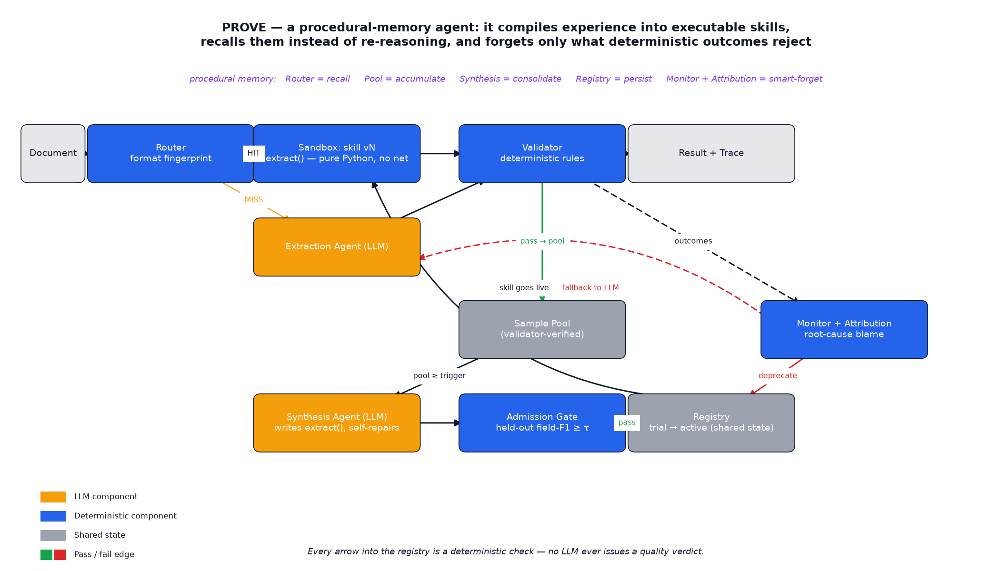
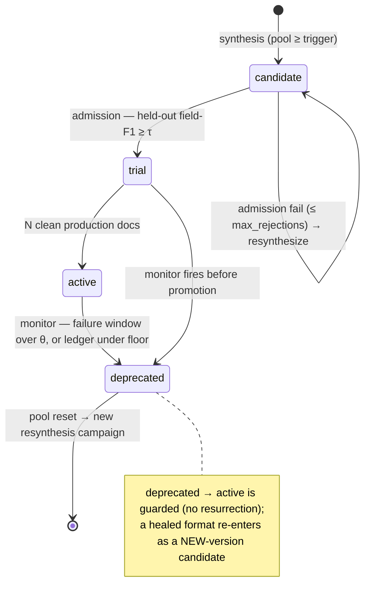
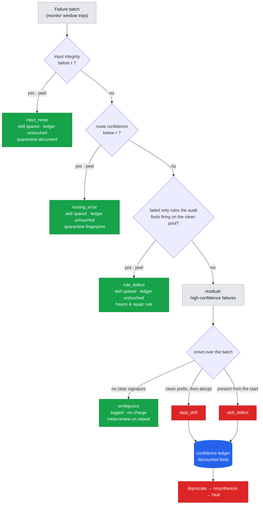
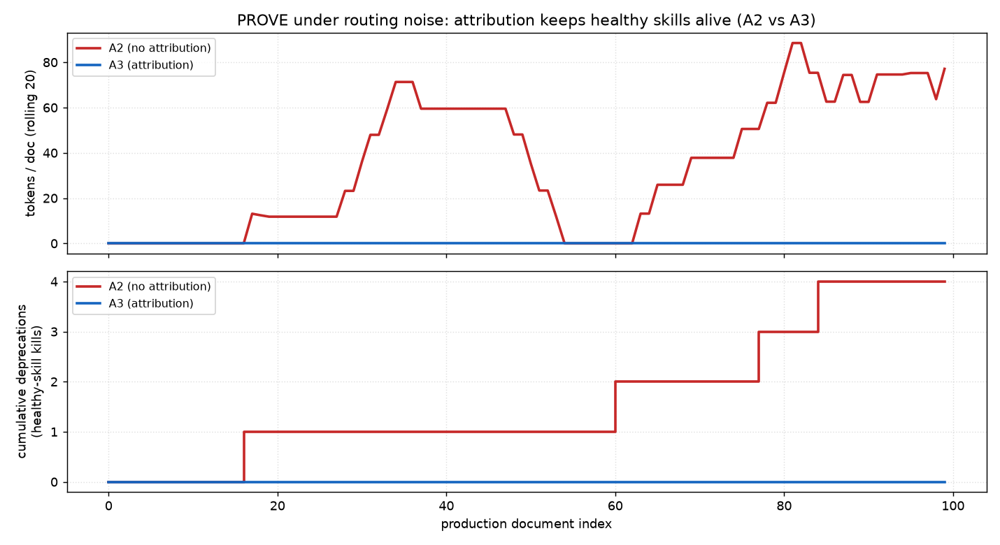
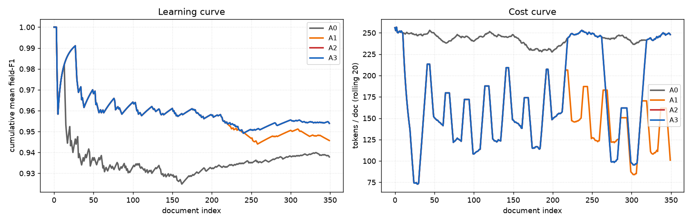
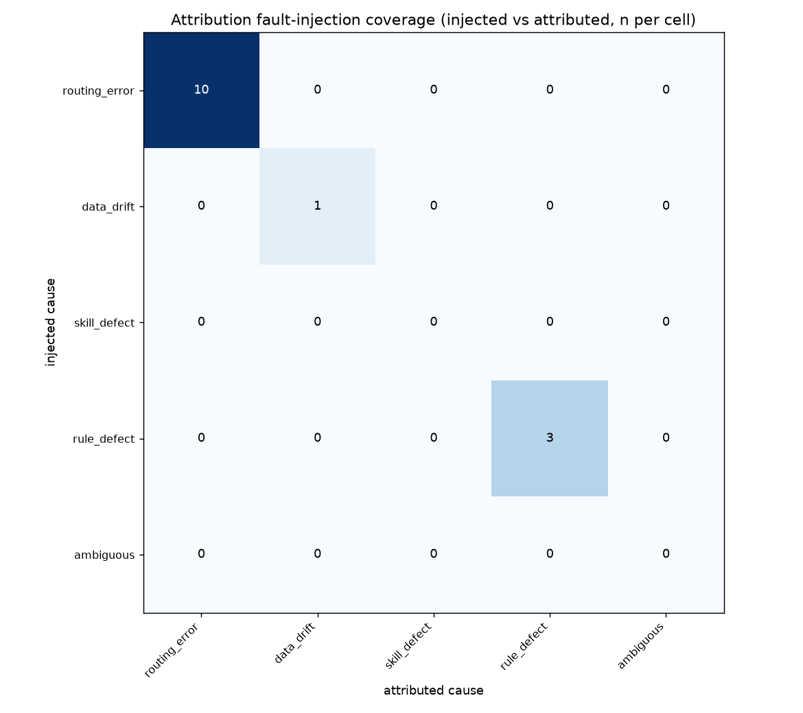
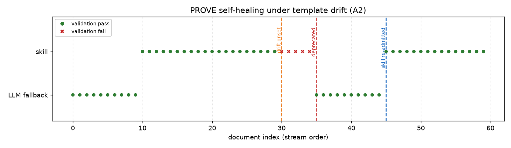

# PROVE

**PROVE** (Procedural Reuse via Outcome-Verified Executables) governs **procedural memory as
executable skills** — written, recalled, and forgotten by deterministic downstream outcomes, with
attribution deciding *which* memory to forget.

As the agent processes documents it **compiles its experience into executable skills (Python parser
code)** — its procedural memory. It **recalls** a skill by document format instead of re-invoking the
LLM, so a remembered format runs as deterministic code at zero marginal inference cost. Every
skill's admission, retention, and **forgetting** is decided by objective downstream checks
(held-out regression tests, rule validation, production pass/fail) — never by an LLM's opinion. An
**attribution module** makes forgetting *smart*: it charges each production failure to the right
account (skill defect / routing error / rule defect / data drift / degraded input), so a healthy
memory is not forgotten for a failure it did not cause.

### ▶ [Watch the animated walk-through](https://lhy3015.github.io/prove-agent/prove_explainer.html)

Cold start → a skill is learned → cost collapses → drift → smart forgetting → relearn, in about a
minute. Source: [`docs/prove_explainer.html`](docs/prove_explainer.html) — it also opens straight
from disk, no server needed.



---

## Qwen Cloud submission — Track 1, MemoryAgent

| Requirement                     | Where                                                                                                                                                                                                                                                                                                  |
| ------------------------------- | ------------------------------------------------------------------------------------------------------------------------------------------------------------------------------------------------------------------------------------------------------------------------------------------------------ |
| Alibaba Cloud services and APIs | [`src/prove/llm_client.py`](src/prove/llm_client.py) — every real model call goes through `OpenAICompatClient` against Alibaba Cloud Model Studio (DashScope), `https://dashscope-intl.aliyuncs.com/compatible-mode/v1`. Models and endpoint in [`configs/default.yaml`](configs/default.yaml). |
| Architecture diagram            | [`docs/architecture.png`](docs/architecture.png)                                                                                                                                                                                                                                                      |
| Live-run evidence               | [`evals/live_results/`](evals/live_results/) — four real-Qwen arms of 420 documents, plus the parser code the model wrote                                                                                                                                                                            |
| Open source licence             | [MIT](LICENSE)                                                                                                                                                                                                                                                                                          |

## Quickstart

**Prerequisites** — Python 3.12 and [uv](https://docs.astral.sh/uv/). Document generation renders
PDFs through WeasyPrint, which needs Pango from the system package manager:

```bash
sudo apt install libpango-1.0-0 libpangoft2-1.0-0   # Debian/Ubuntu; brew install pango on macOS
```

**Install and verify** — the whole system runs with **no API key**: the LLM sits behind an
interface with a deterministic test double, so every test and every simulated experiment below is
reproducible offline.

```bash
uv sync --extra dev          # create the env from pyproject.toml
uv run pytest                # 125 tests, no API key, ~95s
uv run ruff check .          # lint
```

**See the thesis in one command** — inject 20% routing noise and compare an arm that charges every
failure to the skill against one that attributes first:

```bash
uv run python scenarios/routing_noise_demo.py     # → evals/out/routing_noise_comparison.png
```

**The rest of the experiments** (all key-free, all writing to `evals/out/`):

```bash
uv run python scenarios/drift_demo.py           # template drift → deprecate → resynthesize → healed
uv run python scenarios/compound_demo.py        # routing noise + drift in one stream, resolved separately
uv run python -m evals.ablation_curves          # re-runs A0-A3, writes the learning/cost/silent-failure figures
uv run python -m evals.attribution_matrix       # injected-vs-attributed root-cause matrix
uv run python -m evals.ablation --config A0     # a single arm: A0 | A1 | A2 | A3
uv run python -m evals.real_data --source tests/fixtures/cord_schema_replica.jsonl   # real-receipt schema, offline
```

**The API surface** — every response carries an evidence card (routing evidence, executor identity
and confidence, per-rule verdict, cost) lifted from the trace:

```bash
uv run uvicorn prove.service:app --reload        # POST /extract · GET /skills · GET /traces
```

**Live mode (spends tokens).** Real-LLM calls happen only inside `evals/` scripts behind an explicit
`--live` flag, which prints a cost estimate first. Models are set in
[`configs/default.yaml`](configs/default.yaml) and never hardcoded elsewhere.

```bash
export DASHSCOPE_API_KEY=sk-...      # Qwen / Alibaba Cloud Model Studio, region-scoped
uv run python -m evals.ablation --config A3 --live --samples-per-format 30 --tag myrun
uv run python -m evals.ablation --config A3 --live --extraction-model qwen-plus --tag strong
```

The artifacts from the live runs described below — including the **verbatim parser code the model
wrote** — are committed under [`evals/live_results/`](evals/live_results/).

---

## How it works

```
Document in → router computes a header fingerprint
  ├─ hit  → sandbox executes the skill's code → validator checks → result + trace
  └─ miss → extraction agent (LLM) → validator passes → sample joins the verified pool
              └─ pool reaches synthesis_trigger → synthesis agent writes extract(text_layout)
                   → admission runs it on a held-out split → trial → active
Production failures accumulate → monitor raises a batch → attribution assigns the root cause
  skill_defect  → deprecate + resynthesize        routing_error → skill spared, fingerprint quarantined
  data_drift    → deprecate + resynthesize        rule_defect   → skill spared, rule frozen
                                                  input_noise   → skill spared, document quarantined
```

### Hard design rules

1. **No LLM component ever issues a quality verdict.** Verdicts come only from deterministic
   downstream checks. Attribution reads objective signals and traces to assign *blame accounts*; it
   never judges output quality.
2. **Skills are pure executors** — no format-detection logic inside a skill. Routing is a separate
   component, so a wrong recall is attributable rather than hidden inside the code that ran.
3. **All synthesized code executes only inside the sandbox** — `python -I` subprocess, CPU/RSS
   rlimits, import whitelist (`re, json, datetime, decimal, math`), no I/O or network path,
   wall-timeout. Security-tested: `import os` and `open()` are blocked, limits enforced.
4. **Every execution writes a structured trace** — route decision and confidence, skill id/version,
   extraction source, per-field results, validation verdict, tokens. This is attribution's only
   data source.

### The verifier

Six deterministic rules in [`validator.py`](src/prove/validator.py): required fields · currency
whitelist · date sanity · `line_item_count` matched against item rows counted from the layout ·
money arithmetic (`subtotal + tax == total`) · field overlap (two fields must not contain one
another). Rules 4-6 are **cross-field** checks, and that distinction turns out to be the whole
story: form-level rules catch malformed values, and only a rule relating two fields catches a value
that is well-formed and wrong. Its pass verdicts are what admit a sample into the verified pool, so
the rule set is the root of the trust chain.

### Memory lifecycle

A procedural memory is **written** (synthesized), **validated** (admitted), **recalled** (served),
and **forgotten** (deprecated). Every transition is caused by a deterministic event:



- **Recall is exact, not approximate** ([`router.py`](src/prove/router.py)). The fingerprint is the
  set of (static token, x-bucket, y-bucket) triples in the header region above the items table, with
  digit and month tokens dropped; confidence is Jaccard similarity. Deliberately non-vector: an
  approximate recall of *executable* memory runs the wrong code. Dropping digits also means a
  date-format change keeps routing to the existing skill, which is what makes drift separable from
  a genuine new format.
- **Admission** ([`admission.py`](src/prove/admission.py)) holds out 30% of a format's pool, never
  shown to synthesis, and requires field-level F1 ≥ 0.95 in the sandbox. The holdout is persistent,
  so a resynthesized candidate cannot drift onto training data.
- **Confidence ledger** ([`registry.py`](src/prove/registry.py)) — discounted-Beta counters per
  skill, seeded from the held-out result so a skill is never born at 1.0, and updated only by
  admission results and *attributed* production outcomes.
- **Self-healing** ([`pipeline.py`](src/prove/pipeline.py)) — deprecation tombstones the stale pool
  (rows kept for attribution and audit, excluded from synthesis), drops the frozen holdout, and
  opens a fresh synthesis campaign. Resynthesis re-fires only once the pool re-reaches the trigger
  with fresh post-drift samples; that trigger-over-a-cleared-pool *is* the freshness gate, without
  which resynthesis would retrain on pre-drift data and re-deprecate in a loop.

### Attribution

*Which* memory to forget is a mixed signal: a routing misdelivery, a corrupted validator rule, an
unreadable scan, and a genuinely broken skill all look identical at the skill's door. Attribution
decomposes a failure batch **per document** before the ledger forgets anything.

It works by **peeling**: each deterministic test removes from the batch the failures it can account
for and charges them to their own account, and only what survives every test — the *residual* — may
be charged to the skill. Peeling per document rather than judging the batch as a whole is what lets
a mixed batch resolve correctly: routing noise arriving during a genuine defect no longer masks
either one.



*Green bins spare the skill; only the red bins reach the ledger and deprecate. The accountant
assigns blame for already-established failures — it never scores output quality.*

- **Ordering is load-bearing.** `input_noise` is peeled first because garbled header tokens also
  depress route confidence, so a document eligible for two peels must be charged to the root cause
  rather than the symptom. It is the one account with no party to charge and nothing to repair — the
  remedy is to quarantine the document. Without it, a damaged page routes exactly, fails at high
  confidence, survives every other peel, and is charged to a healthy skill.
- **Deferred charging is the entire A2-vs-A3 difference.** In A3 a skill *pass* charges the ledger
  immediately, but a *failure* is only logged until the batch is attributed — β is charged **iff**
  attribution finds the skill at fault. Charging first and refunding after would let a healthy skill
  breach the confidence floor before the refund lands, which is the A2 bug reintroduced as a race.
- **The rule-defect cross-check is an audit, not an opinion** ([`audit.py`](src/prove/audit.py)).
  Re-validating the immutable verified pool identifies the rule that now fires on samples that
  passed at admission: the pool did not change, so the rule did.
- **Fault injectors carry logged ground truth** ([`datagen/faults.py`](src/prove/datagen/faults.py)):
  a `NoisyRouter` that misdelivers traffic at a *genuine* recomputed low Jaccard (a fabricated
  confidence would inject the very signal attribution reads), template drift, a `corrupt_validator`
  that spuriously rejects a valid currency, and a `LayoutGarbler` that damages a band of the page
  body while leaving the header fingerprint intact.

---

## Evidence

All simulated figures below reproduce offline from the commands in the Quickstart. The live figures
come from real Qwen runs whose artifacts are committed in [`evals/live_results/`](evals/live_results/).

### Smart forgetting, quantified — A2 vs A3 under 20% routing noise

| arm                 | healthy memories forgotten | recall-served docs | tokens/doc |
| ------------------- | -------------------------- | ------------------ | ---------- |
| A2 (no attribution) | **4**                | 83 %               | 42.1       |
| A3 (attribution)    | **0**                | 100 %              | 0.0        |

Under the *same* injected noise, A2 wrongly forgets healthy memories — their traffic thrashes back
to the LLM and the skill must be re-learned, so cost rebounds — while A3 attributes the failures to
the router and keeps every memory alive.



### The held-out gate stops silent failures

Four ablation arms over 14 formats / 350 documents. **A0** pure LLM · **A1** skills with no
admission gate · **A2** gate and monitoring · **A3** = A2 + attribution.

| arm                      | tokens/doc      | skill-served docs | silent failures                                 | skills                                   |
| ------------------------ | --------------- | ----------------- | ----------------------------------------------- | ---------------------------------------- |
| A0 (no skills)           | 243.4           | 0                 | 0                                               | —                                       |
| A3 (gate + attribution)  | **173.3** | 102               | 0                                               | 7 active · 3 trial                      |
| A1 (no gate, overfit)    | 145.1           | 142               | **63** — validation passes, fields wrong | 14 active                                |
| A2 (same overfit stream) | 176.1           | 98                | **0**                                     | overfit rejected → good skills admitted |

Without the gate, an overfit skill is admitted and emits confident, deterministic,
*validation-passing* wrong fields; the gate rejects the identical candidate. A1 looks *cheaper*
precisely because it serves more traffic from skills that should never have been admitted.

Per-document cost falls as skills come online and each format stops re-invoking the LLM:



### Attribution coverage

Injected-vs-attributed root cause is a **full diagonal** across routing_error / data_drift /
rule_defect (n=14), with zero cross-cause confusion. This is a *coverage* result rather than a
statistical accuracy claim: the classifier is deterministic and these runs are single-fault, so the
diagonal reads as "every planted root cause leaves a signature the peel recovers." Mixed-cause
resolution is exercised by `scenarios/compound_demo.py`, which runs routing noise and drift in the
same stream and produces 6 routing_error + 2 data_drift verdicts, healing both drifted formats while
sparing both healthy ones.



### Self-healing under drift

```
v1 admitted → drift at doc 30 → deprecated at doc 35 (failure_batch:window 5/20)
  → LLM fallback → pool re-accumulates → v2 admitted at doc 45 → healed
```



### Live runs — real Qwen

Four arms of 420 documents each against real `qwen-turbo` / `qwen-plus` (extraction) and
`qwen-coder-plus` (synthesis). Full notes and the parser code the synthesiser wrote are in
[`evals/live_results/`](evals/live_results/).

|                              | weak        | weak + cross-verify † | **strong**    | weak + rule 6 |
| ---------------------------- | ----------- | ---------------------- | ------------------- | ------------- |
| extraction model             | qwen-turbo  | qwen-turbo             | **qwen-plus** | qwen-turbo    |
| mean field F1                | 0.919       | 0.921                  | **1.000**     | 0.921         |
| validation pass rate         | 0.507       | 0.505                  | **1.000**     | 0.498         |
| skill-served docs            | 115         | 76                     | **198**       | 97            |
| **pool contamination** | **7** | —                     | —                  | **0**   |
| active skills                | 6           | 4                      | **10**        | 5             |
| total tokens                 | 260,669     | 292,289                | 312,788             | 234,674       |

† This arm measured a cross-model verifier that was removed on the strength of these numbers, so
this column alone does not reproduce from the current tree; its artifacts remain. Every other column
reproduces with `python -m evals.ablation --config A3 --live --samples-per-format 30 --tag <arm>`.

**The extraction model, not the pipeline, drove the failures.** Same prompt, same rules, same
synthesiser: pass rate 0.51 → **1.00** purely by moving extraction to `qwen-plus`, for 20% more
tokens. `qwen-turbo`'s dominant error is layout-conditioned — a `Tax 8.25% 365.11` line makes it
return the *rate* where the schema declares a money *amount*.

**Cross-field checks held.** Under the weak extractor `money_unparseable` fired 180 times and
`date_unparseable` 27, keeping every one of those samples out of the pool, so no skill was ever
synthesised from them. Skill-served documents recorded **zero** validation failures in every arm.

**Where no cross-field rule covered a field, errors reached the pool — and the fix was a rule, not a
second model.** Exactly one field contaminated the verified pool: `vendor_name`, 7 of 98 entries,
all the same failure — a two-column header renders invoice number and vendor on one line and the
extractor returned the whole line (`"NAK-2024-22337 Nakatomi Trading Co"`). Well-formed, non-empty,
wrong, invisible to every form-level rule. Gating pool entry on an independent second extractor
detected only ~20-29% of these at +12% tokens, and slowed skill formation, because rejecting samples
shrinks the pools synthesis waits on (skill-served docs 115 → 76). Detection is capped structurally:
the second model shares the layout-induced confusion, so **correlated errors defeat cross-model
agreement**. The three-line field-overlap rule caught **7/7** on replay and **0/420** false
positives, at zero API cost — so the verifier was removed in favour of the rule.

**Attribution issued zero verdicts in every live arm.** It classifies failure *batches* raised by the
monitor, and the monitor watches validation outcomes; skill-served documents had zero validation
failures, so no batch formed. Silent failures pass validation by definition and are therefore
invisible to the monitor — they are caught at admission instead. The bottleneck for attribution is
failures, not document volume.

**Cost is reported in tokens.** Qwen Cloud bills by credit subscription with no published per-token
rate table, so `costs:` is empty and every `cost_usd: 0.0` in the artifacts is a null artifact rather
than a measurement. Synthesis is the larger consumer — 135,367 input tokens on synthesis against
83,203 on extraction — and skill-served documents consume zero marginal inference tokens, which is
what that synthesis cost amortises against.

### Real data — CORD-v2 receipts

[`datasets/cord.py`](src/prove/datasets/cord.py) converts CORD-v2's own OCR word boxes and field
labels into the `text_layout` skill ABI, so every downstream component runs on real receipts
unmodified — no OCR engine, no special-casing. (CORD over SROIE because CORD labels
subtotal/tax/total, so the validator's cross-field money rule survives; SROIE's
company/date/address/total would reduce the verifier to presence checks.)

**100 real test receipts — this section claims safety, not recurrence:**

| observation          | value                              | reading                                                                                                                                                                                                  |
| -------------------- | ---------------------------------- | -------------------------------------------------------------------------------------------------------------------------------------------------------------------------------------------------------- |
| skill hit rate       | **0 / 100**, all `miss`    | The fingerprint is a born-digital construct and real scans carry OCR jitter and crop/skew, so nothing exact-matches. The router**fails closed** and traffic falls back to the LLM at bounded cost. |
| validation pass rate | 0.22                               | **A verifier-transfer finding, not a system metric — never quote it bare.** Decomposition below.                                                                                                  |
| input integrity      | median 1.000, p05 0.957, min 0.889 | 3/100 real docs fall under the 0.95 threshold, calibrated on synthetic damage only. None were skill-served, so no peel fired; the real-text false-positive rate is**unmeasured**.                  |

With extraction exact on all 100, the 0.22 decomposes into `missing_field:tax` 57 ·
`missing_field:subtotal` 35 · `missing_field:total` 5 · `money_unparseable` 59 (knock-on) ·
`money_arithmetic` 15 · passed 22. The first group is a known, deferred profile mis-specification —
`CORD_PROFILE` requires four fields, but real receipts mostly carry no subtotal or tax line. The 15
arithmetic failures are the substantive result: CORD labels a `sub_total.discount_price` category,
and real receipts carry discounts, service charges and rounding, so they are consistent under the
*full* accounting identity while failing the rule's narrower `subtotal + tax == total`. **The
strongest synthetic rule does not transfer unmodified to real receipts.**

---

## Repository map

```
prove-agent/
├── configs/default.yaml         # thresholds, model names, ablation mode — the only place models are named
├── src/prove/
│   ├── schemas.py               # pydantic models everything else depends on
│   ├── layout.py                # PDF → text_layout dict (the versioned skill ABI) + input_integrity
│   ├── router.py                # header fingerprint + Jaccard recall
│   ├── extraction_agent.py      # LLM fallback, used only on a routing miss
│   ├── validator.py             # the six deterministic rules
│   ├── sample_pool.py           # per-format store of validator-passed samples (tombstoned, never deleted)
│   ├── synthesis_agent.py       # LLM writes extract(text_layout); self-repair loop in the sandbox
│   ├── sandbox.py               # isolated subprocess: rlimits, import whitelist, no network
│   ├── admission.py             # persistent held-out gate, field-F1 in the sandbox
│   ├── registry.py              # SQLite state machine + discounted-Beta confidence ledger
│   ├── monitor.py               # per-skill sliding window + ledger floor
│   ├── attribution.py           # the peel classifier
│   ├── audit.py                 # re-validates the pool → identifies a corrupted rule
│   ├── pipeline.py              # LangGraph per-doc graph + lifecycle + deferred charging
│   ├── service.py               # FastAPI: /extract (evidence card), /skills, /traces
│   ├── traces.py                # one structured row per document — attribution's only input
│   ├── llm_client.py            # LLMClient interface + FakeClient (key-free) + OpenAICompatClient
│   ├── datagen/                 # Jinja2 templates → synthetic PDFs + ground truth; faults.py injectors
│   └── datasets/cord.py         # CORD-v2 → text_layout adapter
├── evals/
│   ├── ablation.py              # A0-A3 runner (--live for real spend)
│   ├── ablation_curves.py       # re-runs all four arms and writes the figures
│   ├── attribution_matrix.py    # injected-vs-attributed coverage matrix
│   ├── real_data.py             # CORD-v2 external-validity probe
│   ├── fake_skills.py           # deterministic synthesiser double that keeps CI key-free
│   └── live_results/            # committed real-Qwen artifacts + the parser code the model wrote
├── scenarios/                   # drift_demo · routing_noise_demo · compound_demo · architecture_diagram
├── docs/                        # figures + the animated explainer
└── tests/                       # 125 pytest unit + integration tests
```

## Configuration

Everything tunable lives in [`configs/default.yaml`](configs/default.yaml): the per-role model tiering
(`model.extraction` / `model.synthesis` / `model.attribution` ), `synthesis_trigger` and `trial_docs`, the admission thresholds, the monitor window and
confidence floor, the ledger's Beta prior and decay, attribution's `conf_tau` / `integrity_tau` /
`drift_prefix_frac`, sandbox limits, and `ablation.mode`.

## Limitations

- **A self-supervised admission oracle is bounded by the extractor's systematic-error floor.**
  Admission compares a candidate against its format's verified pool, and the pool is LLM-produced.
  Where the extractor is systematically wrong on a field no cross-field rule constrains, the pool
  encodes the error, the skill reproduces it, and admission sees agreement. This is why the fix for
  pool contamination was a new cross-field rule rather than a stronger gate.
- **A3 degrades toward A2 under heavy noise, by design.** If a batch contains no clean
  high-confidence baseline, the peel cannot prove the skill works, so it conservatively charges the
  skill.
- **Recurrence on real scans needs a fuzzy router.** Coarser coordinate buckets force a lower
  exact-match threshold, which would drop all real-data routing below attribution's confidence
  threshold and break blame assignment in a new way — routing and attribution have to be
  recalibrated together.
